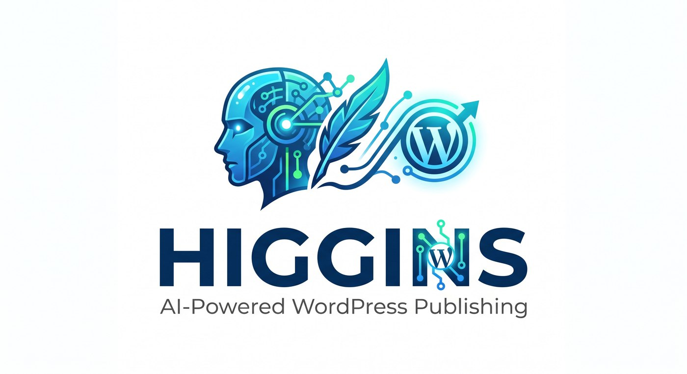

<p align="center"></p>

# Higgins

Scrivi pagine e articoli in Markdown, in locale. Uno script li pubblica su WordPress
via SSH + WP-CLI. Un secondo script genera la copertina di ogni articolo con un
modello di immagini gratuito e la carica come featured image.

Niente plugin da installare sul sito, nessuna REST API key di WordPress, nessun
database esposto: solo la chiave SSH che probabilmente hai già.

## Perché

Il flusso normale — wp-admin, editor a blocchi, upload manuale delle immagini — non
si presta ad automazione né a essere versionato. Questo repo tratta i contenuti come
codice: un file per pagina/articolo, uno storico in git, una pubblicazione ripetibile
e senza sorprese (con `--dry-run` prima di ogni caricamento vero).

È pensato per essere usato insieme a [Claude Code](https://claude.com/claude-code)
con un `CLAUDE.md` di progetto che descrive il tono del sito, le regole editoriali e
cosa non va mai inventato — questo repo resta lo strato di pubblicazione, il
`CLAUDE.md` resta lo strato di giudizio. Non è un requisito: gli script funzionano
anche scrivendo i `.md` a mano.

## Cosa serve

- Una chiave SSH che arriva al server con un utente che può eseguire `wp` (va bene
  anche solo per quel comando, via sudoers — vedi "Sicurezza" più sotto)
- [WP-CLI](https://wp-cli.org/#installing) installato **sul server**
- Python 3.10+ in locale, con:
  ```
  pip install markdown pyyaml Pillow
  ```

Windows, macOS, Linux: funziona ovunque ci sia un client SSH (su Windows, OpenSSH è
già incluso da anni) e Python.

## Avvio rapido

```bash
git clone https://github.com/simonecosci/higgins.git
cd higgins
pip install markdown pyyaml Pillow

cp config.example.yml config.yml
# modifica config.yml: alias ssh, percorso di WordPress sul server, autore

ssh <il-tuo-alias> wp --info --path=<percorso-wordpress>   # verifica che WP-CLI risponda

python publish.py --dry-run          # non tocca niente, mostra solo cosa farebbe
```

Se il dry-run trova dei `.md` di esempio, va tutto bene: mostra cosa succederebbe,
niente viene scritto sul sito finché non lanci lo stesso comando senza `--dry-run`.

## Struttura

```
higgins/
├── contenuti/            # un .md per pagina/articolo, nome file = slug
├── immagini/              # copertine generate, <slug>.png (create in automatico)
├── publish.py             # pubblica: legge contenuti/, scrive su WordPress via SSH
├── featured.py            # genera la copertina di un articolo, chiamato da publish.py
├── config.yml             # server, percorso, autore — NON va in git (dati reali)
├── config.example.yml     # il template da copiare
├── .env                   # chiavi dei provider immagine — NON va in git
├── .env.example            # il template da copiare
└── FORMATO-CONTENUTO.md   # riferimento del formato di un contenuto
```

`config.yml`, `.env`, e i log restano fuori da git di proposito (vedi `.gitignore`):
il primo punta a un server reale, il secondo contiene credenziali. Copia i due file
`.example` e riempili con i tuoi valori.

## Il formato di un contenuto

Un file in `contenuti/<slug>.md`, front-matter YAML più corpo in Markdown:

```markdown
---
title: Automazione dei processi aziendali
slug: automazione-dei-processi-aziendali
type: page                   # post | page | jetpack-portfolio
excerpt: Una riga di riepilogo — meta description se non usi un plugin SEO, o se
         il plugin SEO non ne ha già una impostata per questo contenuto.
categories: [12]              # ID numerici: wp term list category --fields=term_id,name
tags: [automazione, php]      # nomi liberi, creati se non esistono
parent: 12                    # opzionale, ID della pagina padre
author: 1                     # opzionale, ID utente WP — altrimenti quello in config.yml
image_prompt: a sheet of paper on the left, three lines to a circle on the right
---

## Titolo di sezione

Testo in Markdown normale. Diventa HTML a blocchi Gutenberg compatibile con
l'editor nativo di WordPress.
```

Riferimento completo, con un esempio minimo pronto da copiare: `FORMATO-CONTENUTO.md`.

Campi obbligatori: `title`, `slug`. Tutto il resto è opzionale. `type` di default è
`post`. `jetpack-portfolio` serve solo se il sito usa il custom post type dei
progetti di Jetpack — ignoralo altrimenti.

## Pubblicare

```bash
python publish.py --dry-run                       # cosa farebbe, nessuna modifica
python publish.py contenuti/pagina.md              # pubblica online quel file
python publish.py contenuti/pagina.md --draft      # lo carica come bozza
python publish.py contenuti/pagina.md --no-image   # senza generare la copertina
python publish.py --solo-copertina contenuti/x.md  # solo la featured image, il testo resta com'è
python publish.py                                  # tutti i .md in contenuti/, senza argomenti
```

Idempotente sullo slug: se un contenuto con quello slug esiste già, lo aggiorna sul
posto; altrimenti lo crea. Rilanciare lo stesso comando non duplica niente.

**Attenzione**: pubblicare aggiorna un contenuto esistente *per intero* — sostituisce
il testo online con quello del file. Non c'è una copia di sicurezza automatica: se il
file è incompleto, quello che c'è online oggi va perso. Usa sempre `--dry-run` prima.

Un post nuovo destinato a `publish` viene creato prima come bozza, poi gli si imposta
la copertina, e solo alla fine viene reso pubblico — così un eventuale plugin di
auto-condivisione sui social (Blog2Social e simili si agganciano tipicamente
all'evento `transition_post_status`) trova già l'immagine quando genera l'anteprima.
Un contenuto già online, invece, si aggiorna sul posto senza questo passaggio: rimetterlo
in bozza per un attimo lo toglierebbe dal sito e potrebbe far scattare una seconda
condivisione per un semplice aggiornamento.

## Copertine

Ogni articolo (`type: post`) creato da qui ha la sua immagine di copertina, generata
da `featured.py` e caricata automaticamente da `publish.py`. Il prompt viene composto
da titolo, excerpt e tag — oppure lo scrivi tu con `image_prompt:` nel front-matter.
Con `image: false` nel front-matter, niente copertina per quel contenuto.

```bash
python featured.py --providers                    # quali provider risultano configurati
python featured.py contenuti/x.md --prompt-only    # mostra il prompt, senza chiamare l'API
python featured.py contenuti/x.md --force          # rigenera la copertina da capo
```

Provider supportati, in ordine di tentativo — usa il primo che trova configurato in
`.env` o nell'ambiente:

| Provider | Variabili | Note |
|---|---|---|
| Hugging Face | `HF_TOKEN` | FLUX.1-schnell, gratuito, nessuna carta |
| Cloudflare Workers AI | `CF_ACCOUNT_ID` + `CF_API_TOKEN` | stesso modello, 10.000 neuroni/giorno gratis |
| Google Gemini | `GEMINI_API_KEY` | `gemini-2.5-flash-image`, richiede fatturazione attiva sul progetto AI Studio |
| Pollinations | nessuna chiave | solo con `--provider pollinations`: il tier anonimo serve un modello diverso e la resa tende a essere inutilizzabile |

**Senza nessun provider configurato non si inventa un ripiego**: `featured.py` lo
dice chiaramente, e `publish.py` pubblica comunque il testo, senza immagine.

Le copertine non si rigenerano a ogni pubblicazione (due upload dello stesso file
danno la stessa immagine — serve `--force` per rifarla), e **una copertina già
presente su un contenuto non viene mai sovrascritta**: se c'è, l'ha messa una
persona a mano.

Lo stile visivo è una costante in cima a `featured.py` (`STILE`): cambiala lì per
tutte le copertine future, così restano una famiglia coerente invece di immagini
scollegate fra loro.

Un paio di cose imparate sul campo, per non perdere tempo a riscoprirle:

- **Prompt corti.** Con 4 step di inferenza (FLUX-schnell) un prompt lungo produce
  composizioni affollate; uno di due righe dà risultati puliti.
- **Mai negazioni nel prompt.** "no lightbulbs, no faces" tende a rendere quegli
  elementi *più* probabili, non meno. Descrivi solo cosa vuoi vedere.
- `image_prompt` funziona meglio in inglese e concreto ("a sheet of paper on the
  left, three lines to a circle on the right") — il solo titolo in italiano produce
  quasi sempre illustrazioni generiche.

## Automazione (opzionale)

`daily.cmd.example` e `weekly.cmd.example` mostrano come lanciare Claude Code in
modalità non interattiva (`claude -p`) per scrivere e pubblicare un contenuto al
giorno da una coda, con log su file e pulizia automatica.

**Il ciclo si autoalimenta.** La coda vive in un file Markdown (`<NOME-FILE-CODA>.md`
nell'esempio — nel mio caso `argomenti.md`) con tre sezioni: Coda, Pubblicati,
Scartati. Ogni giorno `daily.cmd` prende la prima voce, la scrive, la pubblica, e la
sposta in Pubblicati. **Se la coda è vuota, prima di scrivere il post del giorno se ne
rigenera una nuova da sola** — nuovi argomenti, mai un doppione di quello che è già
in Pubblicati, in Scartati o online sul sito (lo script lo verifica interrogando
WordPress). Non serve mai riempirla a mano perché continui a girare; `weekly.cmd` è
solo un rinforzo opzionale, che la riporta a N voci senza toccare quelle già presenti.

La regola che tiene in piedi tutto: se un argomento richiederebbe un dato che lo
script non ha (un dettaglio tecnico, un numero, un fatto verificabile), quella voce
finisce in Scartati con il motivo, e si passa alla successiva — **niente si inventa
per fare numero**. Meglio una coda più corta di una piena di argomenti deboli.

Copia i due `.example` senza l'estensione, sostituisci i placeholder `<...>` e
pianificali con lo scheduler del tuo sistema (`schtasks` su Windows, `cron` altrove).

Restano fuori da git anche loro (finiscono per contenere dominio e percorsi reali),
insieme a `config.yml` e `.env`. Sul contenuto del prompt: la versione reale che uso
è più dettagliata di questi esempi — include per esempio le regole per verificare
ogni dato su fonte primaria prima di scrivere di una CVE, con `WebSearch`/`WebFetch`
fra gli `allowedTools`. Quel livello di dettaglio conviene scriverlo nel prompt
stesso, non solo nel `CLAUDE.md` di progetto: in modalità `-p`, senza nessuno che
confermi da terminale, la routine deve reggersi in piedi da sola.

## Sicurezza

- **Nessuna credenziale in questo repo.** L'accesso al server è via chiave SSH; le
  uniche chiavi che vivono qui sono quelle (opzionali) dei provider di immagini, in
  `.env`, escluso da git.
- **Limita cosa può fare l'utente SSH sul server.** Lo script usa solo comandi
  `wp` in lettura, più poche scritture ben definite (crea/aggiorna contenuti,
  carica un'immagine come featured, imposta una singola meta key). Un sudoers
  che permetta *solo* `wp` a quell'utente (non una shell generica) riduce di molto
  cosa può succedere se la chiave o il PC locale vengono compromessi.
- **`--dry-run` prima di ogni pubblicazione reale.** Non è solo una raccomandazione:
  è quello che evita di scoprire un front-matter sbagliato dopo aver già sovrascritto
  una pagina online.
- Se personalizzi lo script per fare scritture diverse via SSH, tienile esplicite e
  ristrette (un comando preciso, non una shell generica) — è molto più facile
  verificare "questo script può fare solo X" che "questo script ha accesso a tutto".

## Licenza

MIT — vedi `LICENSE`.
